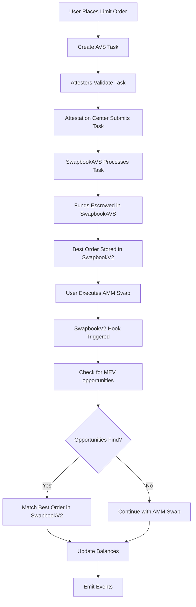

# SwapbookV2: An MEV-driven Decentralized Orderbook System with AMM and Hook Integration

[Slides](https://drive.google.com/drive/folders/1JXJ-XmnemSCLHhIlg3B5NSP5I--QFMOn?usp=sharing) | [Demo Video](https://drive.google.com/drive/folders/1JXJ-XmnemSCLHhIlg3B5NSP5I--QFMOn?usp=sharing)

## 🚀 Overview

SwapbookV2 is a revolutionary decentralized orderbook system that seamlessly integrates with AMM through Uniswap V4 hooks and leverages AVS (Actively Validated Services) for order management. The system enables MEV-driven order matching, peer-to-peer trading, and advanced limit order functionality while maintaining the liquidity and price discovery benefits of automated market makers.

### Key Features

- **🪝 Uniswap V4 Hook Integration**: Hooks enabling re-routing of orderbook limit orders within AMM swaps
- **📊 Decentralized Orderbook**: The decentralized orderbook executes off-chain, with consensus secured on-chain via EigenLayer AVS.
- **⚡ MEV-Driven Execution**: Orders are executed when MEV opportunities arise during swaps
- **🔒 AVS Escrow System**: Secure fund management through SwapbookAVS (Actively Validated Service)
- **🎯 Limit Orders**: Support for tick-based limit orders with precise price control
- **📈 Price Discovery**: Combines AMM liquidity with orderbook price discovery

## 🏗️ Architecture

### Core Components

#### 1. SwapbookV2 Hook (`src/SwapbookV2.sol`)
- **Uniswap V4 Hook**: Integrates with Uniswap V4's hook system
- **Order Execution**: Executes limit orders before and after swaps
- **Price Tracking**: Maintains best price information for each pool
- **Event Emission**: Tracks order execution events

#### 2. SwapbookAVS (`src/SwapbookAVS.sol`)
- **AVS Implementation**: Actively Validated Service for order management
- **Escrow Management**: Holds user funds for limit orders
- **Order Processing**: Handles order creation, matching, and execution
- **Task Management**: Processes different types of order operations
- **Fund Security**: Implements secure deposit and withdrawal mechanisms

#### 3. Integration Layer
- **Attestation Center**: Manages order validation and processing
- **EigenLayer AVS**: Provides decentralized validation and consensus for order operations

### System Flow



## 🛠️ Installation & Setup

### Quick Start

1. **Install dependencies**
   ```bash
   forge install
   ```

2. **Set up environment variables**
   ```bash
   cp .env.example .env
   # Edit .env with your configuration
   ```

3. **Deploy contracts**
   ```bash
   # Deploy SwapbookV2 hook
   ./0_DeploySwapbookV2.sh
   
   # Deploy SwapbookAVS
   ./1_DeploySwapbookAVS.sh
   ```

## 📋 Usage Scenarios

### Scenario 1: Limit Order Matching in MEV Execution for Better Uniswap Pricing
Demonstrates how a Uniswap user benefits from enhanced execution by pairing an advantageous MEV frontrun with orderbook limit orders.

```bash
./2_DeployTestTokens.sh
./3_SetupIntegration.sh
./4_MintTestTokens.sh
./5_InitPoolAndAddLiquidity.sh
./6_Scenario1.sh
```

**Features:**
- Swapbook user places a limit order (sell 100 tokenA for 100.6 tokenB at tick -60).
- Uniswap user executes a swap (buy tokenA) via the Universal Router.
- SwapbookV2 identifies a benifit MEV frontrun opportunity relative to the Uniswap user’s order.
- The limit order is automatically matched during MEV execution in `beforeSwap`, enhancing execution for the Uniswap user.
- Events are emitted to record the order execution.

### Scenario 2: Enhanced Execution from Large Swap Backrun and Pool Price Restoration
Shows how large swaps trigger a backrun that executes limit orders, enabling both Uniswap and Swapbook users to gain from pool price restoration.

```bash
./2_DeployTestTokens.sh
./3_SetupIntegration.sh
./4_MintTestTokens.sh
./5_InitPoolAndAddLiquidity.sh
./6_Scenario2.sh
```

**Features:**
- Swapbook user places a limit order (sell 4000 tokenA for 4007 tokenB at tick 60).
- Uniswap user executes a large swap (buy tokenA) through the Universal Router.
- The large swap (4500 tokenB) shifts the pool tick above the limit order’s tick.
- During MEV execution in `afterSwap`, the limit order is automatically matched, improving execution for subsequent Uniswap users.
- The pool price then restore to its original level.

### Scenario 3: Peer-to-Peer Order Matching
Demonstrates direct order matching between two Swapbook users without AMM involvement.

```bash
./2_DeployTestTokens.sh
./3_SetupIntegration.sh
./4_MintTestTokens.sh
./5_InitPoolAndAddLiquidity.sh
./6_Scenario3.sh
```

**Features:**
- Two users place opposing limit orders at the same tick (0)
- Orders are matched and executed peer-to-peer
- No AMM swap required for matching. No trading fee.

## 🔗 EigenLayer AVS Integration

SwapbookV2 leverages EigenLayer's Actively Validated Services (AVS) framework to provide decentralized validation and consensus for orderbook operations.

### AVS Architecture

#### Core Components
- **SwapbookAVS Contract**: Implements `IAvsLogic` interface for EigenLayer integration
- **Attestation Center**: Manages task validation and submission
- **Attesters Network**: Decentralized validators that approve order operations
- **Task Processing**: Handles 5 different order operation types

#### AVS Task Types
```solidity
enum TaskType {
    NoOp,             // 0: No operation needed
    UpdateBestPrice,  // 1: Update best price order
    PartialFill,      // 2: Partially fill an order
    CompleteFill,     // 3: Completely fill an order
    ProcessWithdrawal // 4: Process user withdrawal
}
```

#### Task Processing Flow
1. **Task Creation**: User creates order operation task
2. **Attestation**: Network of attesters validates the task
3. **Submission**: Attestation Center submits validated task to SwapbookAVS
4. **Execution**: AVS processes the task and updates orderbook state
5. **Event Emission**: Results are logged for tracking and monitoring

#### Security Features
- **Cryptographic Validation**: All tasks include digital signatures
- **Consensus Requirement**: Multiple attesters must approve tasks
- **Access Control**: Only authorized operators can submit tasks
- **Reentrancy Protection**: Secure task processing without vulnerabilities

#### AVS Benefits
- **Decentralized Validation**: No single point of failure
- **Cryptographic Security**: Tamper-proof task validation
- **Modular Design**: Clean separation of concerns
- **Scalable Architecture**: Off-chain validation with on-chain execution

### Integration Example

```solidity
// Create UpdateBestPrice task
bytes memory updateTaskData = abi.encode(
    uint256(SwapbookAVS.TaskType.UpdateBestPrice),
    token0Address,
    token1Address,
    60,  // tick
    true, // zeroForOne
    100e18, // inputAmount
    1006e17, // outputAmount
    userAddress,
    false // useHigherTick
);

// Submit to AVS for processing
swapbookAVS.afterTaskSubmission(
    updateTaskInfo,
    true,  // isApproved by attesters
    "",    // tpSignature
    [uint256(0), uint256(0)], // taSignature
    new uint256[](0) // attestersIds
);
```

## 🧪 Testing

### Run All Tests
```bash
forge test
```

## 🙏 Acknowledgments

- [Uniswap V4](https://uniswap.org/) for the AMM infrastructure and UniswapV4 hook
- [Eigen Layer](https://www.eigencloud.xyz/) for the AVS infrastructure
- [Othentic](https://www.othentic.xyz/) for the AVS framework


